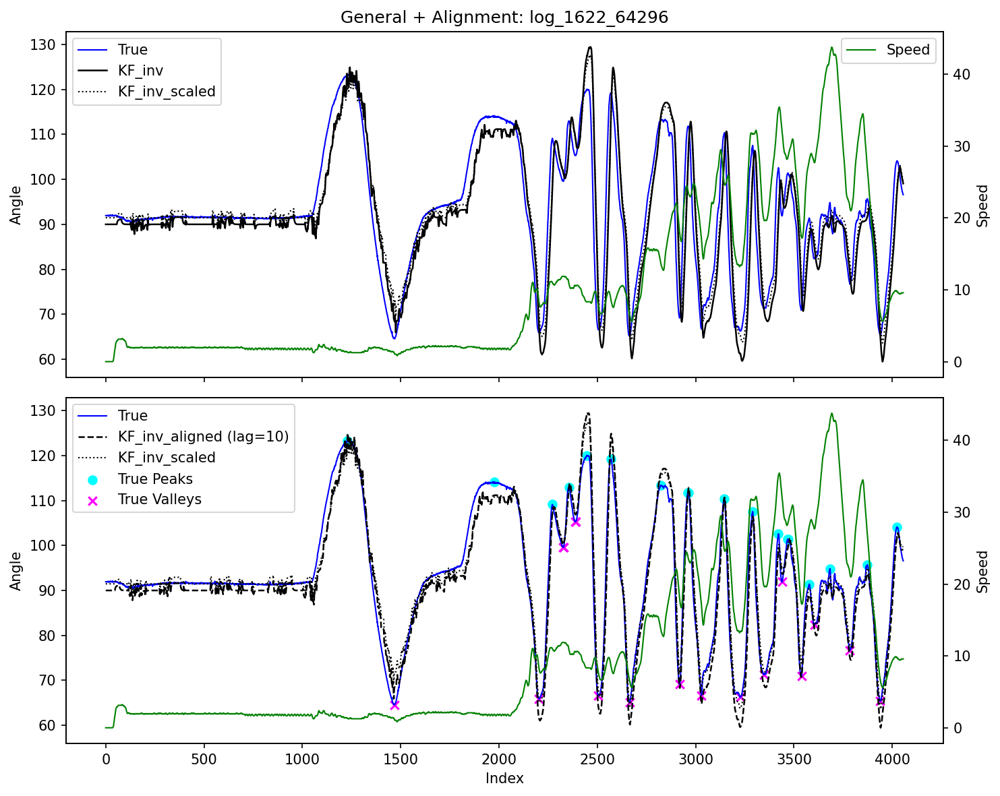
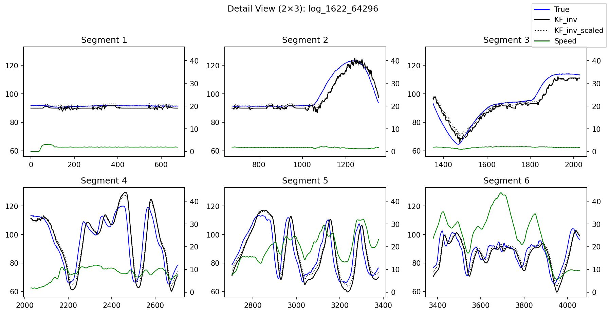
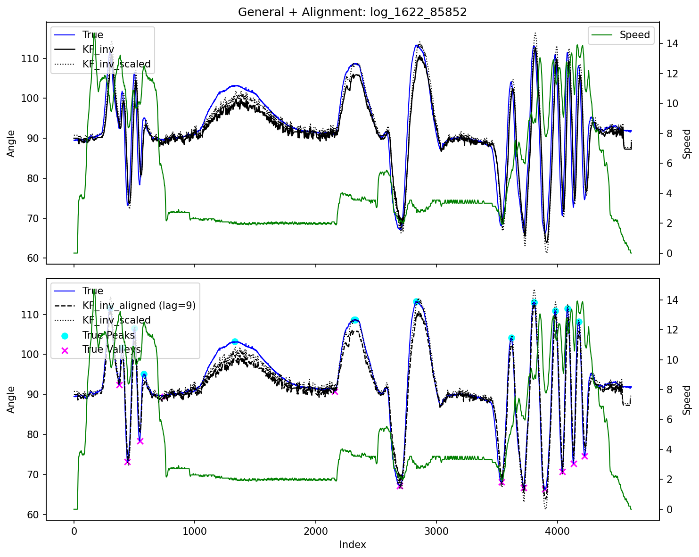
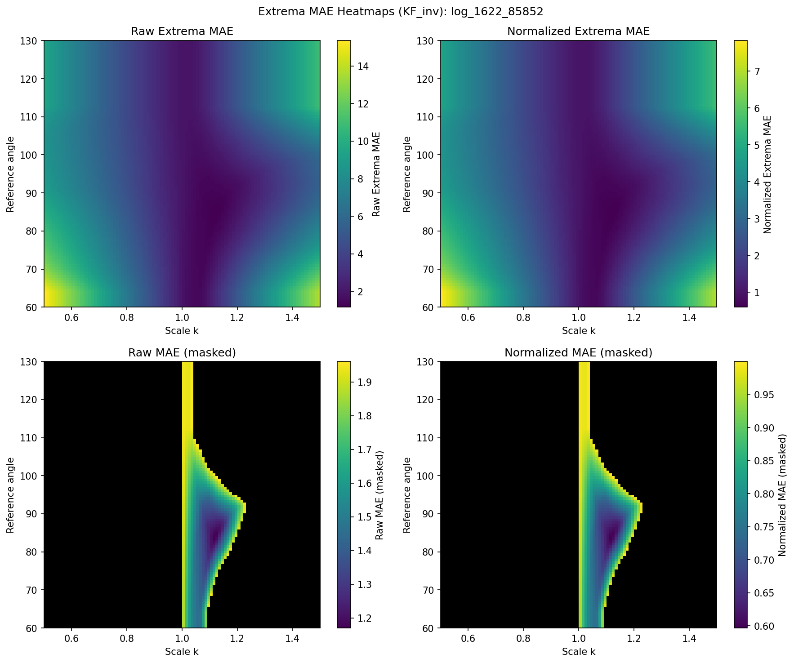
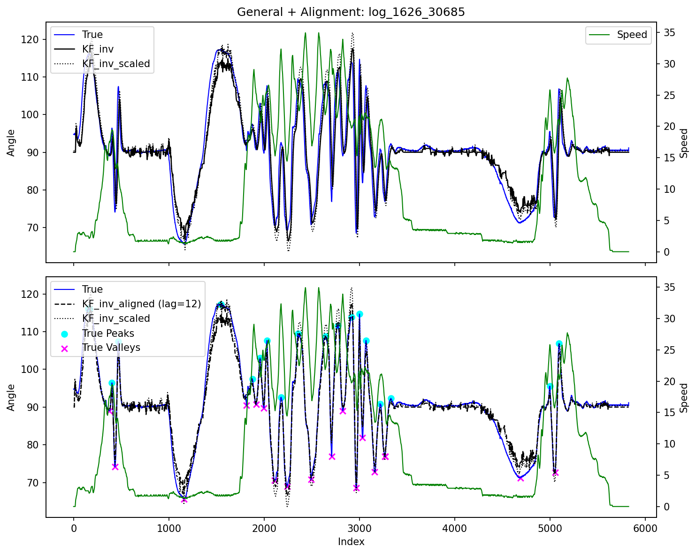
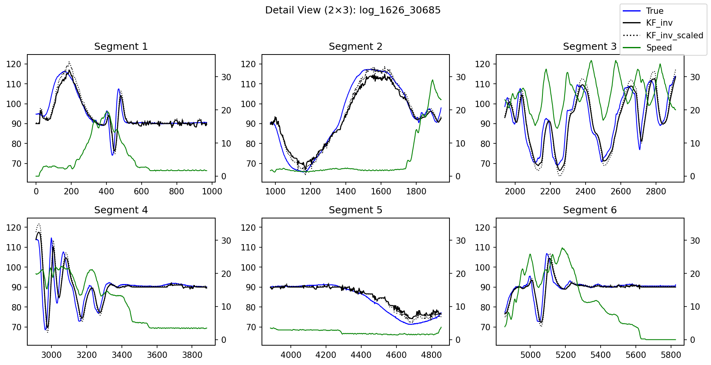
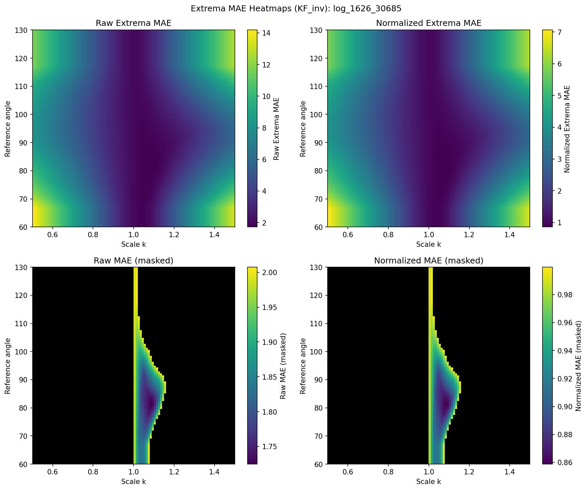
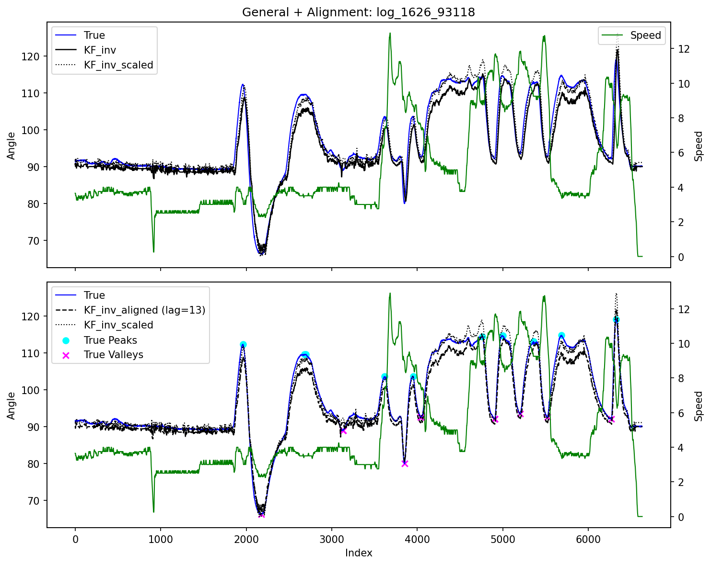

<!-- LANGUAGE TOGGLE START -->
<p align="right">
  <a href="README.md"></a>
  <a href="DE_README.md"></a>
</p>
<!-- LANGUAGE TOGGLE END -->

# Winkel­sensor‑Filterung & Extremum‑Verfolgung

## Übersicht
Rohe Licht‑Sensor‑Arrays geben einen verrauschten Einblick in die Ausrichtung von Traktor und Anhänger. Ziel ist es, diese preiswerten Messwerte gemeinsam mit der Fahrzeuggeschwindigkeit in ein stabiles Deichsel‑Winkelsignal umzuwandeln. Ein hochwertiger Referenzsensor liefert den **Ground Truth** für Kalibrierung und Evaluierung. Anstatt bestimmte Dateinamen fest zu verdrahten, ist dieser Workflow so konzipiert, dass er auf **jede neue Aufzeichnung** (CSV‑Datei), die Sie bereitstellen, angewendet werden kann.

Solange jede CSV die gleichen Spaltenkonventionen einhält (Summen der linken/rechten Sensoren, eine Referenzwinkel‑Spalte, eine Geschwindigkeits‑Spalte und einen Zeitstempel), gelten dieselben Schritte für Vorverarbeitung, Filterung, Ausrichtung und Auswertung. 

Für aktuelle Kennzahlen und Diagramme, die von der CI‑Workflow generiert werden, siehe den Abschnitt [Neueste Ergebnisse](#10-neueste-ergebnisse) unten.

## Hauptaufgabe
Unser Ziel ist es, eine klar nachvollziehbare Beispiel‑Pipeline bereitzustellen, die:

1. **Beliebige CSVs** aus `recordings/` einliest.  
2. Aus den Licht‑Sensor‑Arrays eine Schätzung des Deichselwinkels ableitet.  
3. Die Referenzsensor‑ und Geschwindigkeits‑Spalten bereinigt.  
4. Einen geschwindigkeitsabhängigen Kalman‑Filter sowie optionale Alternativen ausführt.  
5. Das gefilterte Ergebnis mit der Referenz ausrichtet und Fehlermetriken protokolliert.  
6. Reproduzierbare Diagramme in `results/` zur Einsicht ablegt.  

Betrachten Sie dieses Repository als Ausgangspunkt, um mit Filtermethoden zu experimentieren und Verbesserungen beizutragen.

---

## Verzeichnisstruktur
```text
.
├── README.md               ← Diese Datei (allgemeine Anleitung)
├── filter_analysis.py      ← Python‑Skript (lädt CSV, verarbeitet, plottet, Kennzahlen)
├── recordings/             ← Platzieren Sie hier Ihre CSV‑Aufzeichnungen
│   ├── log_1618_76251.csv  ← Beispiel‑Aufzeichnung
│   ├── log_1622_64296.csv
│   └── log_1626_93118.csv
└── results/                ← Auto‑generierte Diagramme und `performance.csv`
```

- **filter_analysis.py**: Enthält den gesamten Code zum Laden, Vorverarbeiten, Filtern, Ausrichten und Bewerten der Leistung.  
  Es verarbeitet **jede CSV‑Aufzeichnung** im Ordner `recordings/` automatisch.  

- **recordings/**: Ordner, in dem Sie jede neue CSV‑Protokolldatei ablegen.  
  Jede Datei muss folgende Spalten (exakte deutsche Logger‑Namen) enthalten:
  - `Durchschnitt_L_SE` und `Durchschnitt_L_Be_SE` – Summen der linken Licht‑Sensoren,
  - `Durchschnitt_R_SE` und `Durchschnitt_R_Be_SE` – Summen der rechten Licht‑Sensoren,
  - `Deichsel_Angle` – Referenzwinkel Deichsel,
  - `Geschwindigkeit` – Fahrzeuggeschwindigkeit,
  - `ESP Time` – Zeitstempel in Millisekunden.
  - Optionale redundante Sensoren `Durchschnitt_L_SE2`, `Durchschnitt_L_Be_SE2`, `Durchschnitt_R_SE2` und `Durchschnitt_R_Be_SE2` (sind 0, wenn nicht verwendet).

- **results/**: Wird beim Ausführen des Skripts automatisch erstellt. Enthält PNG‑Diagramme und eine Zusammenfassung `performance.csv`.

---

## 1. Was wir erreichen wollen
1. **Rohes Deichselwinkel‑Proxy** aus linken/rechten Sensorsummen berechnen.  
2. **Zielreferenz bereinigen**, indem Null‑Aussetzer interpoliert werden.  
3. **Geschwindigkeit vorverarbeiten**, indem negative Werte beschnitten, Nullen (nur zwischen erstem und letztem Bewegungszeitpunkt) interpoliert und ein kleiner gleitender Mittelwert angewendet wird, um Jitter zu entfernen.  
4. **Spikes entfernen** aus dem rohen Proxy mittels kausalem Hampel‑Filter (Fenster=5).  
5. **Geschwindigkeitsabhängigen Kalman‑Filter** (KF_inv) in Echtzeit anwenden, wobei die Prozessrausch‑Varianz mit 1/Geschwindigkeit skaliert wird.  
6. **Lokale Extrema (Peaks & Valleys) erkennen** im bereinigten Referenzsignal, um zu quantifizieren, wie gut jeder Filter Hoch‑/Tiefpunkte bewahrt.  
7. **Ausrichten**, indem gefilterte Ausgaben über Extremum‑Indizes an die Referenz angepasst werden, sodass Peak‑/Valley‑Fehler an den korrekten Zeitpunkten gemessen werden.  
8. **Metriken berechnen** (RMSE, MAE plus spezialisierte Extrema‑MAE), um die Leistung zu bewerten.  
9. **Optional alternative Filter testen** (z. B. Savitzky–Golay und hybrides KF_on_SG) auf derselben Aufzeichnung und Ergebnisse vergleichen.

Da jede Aufzeichnungsdatei identische Spaltennamen/-muster verwendet, können Sie einfach neue CSVs in das Verzeichnis `recordings/` legen und das Skript erneut ausführen.

---

## 2. Vorverarbeitungsschritte (Einzelne Aufzeichnung)

Wenn Sie das Analyseskript auf eine neue Aufzeichnung anwenden:

1. **CSV laden** in ein DataFrame.
2. **Spalten identifizieren** anhand ihrer Spaltennamensmuster:
   - `Deichsel_Angle` (Referenzwinkel Deichsel),
   - `Geschwindigkeit` (Fahrzeuggeschwindigkeit),
   - `Durchschnitt_L_SE` und `Durchschnitt_L_Be_SE` (linke Licht-Sensor-Summen),
   - `Durchschnitt_R_SE` und `Durchschnitt_R_Be_SE` (rechte Licht-Sensor-Summen),
   - Optionale redundante Sensoren: `Durchschnitt_L_SE2`, `Durchschnitt_L_Be_SE2`, `Durchschnitt_R_SE2`, `Durchschnitt_R_Be_SE2`.
3. **Rohwert-Proxy berechnen**:
  - Das Skript prüft automatisch, ob die redundanten Sensorspalten Werte ungleich Null enthalten.
   Wenn ja, werden alle vier Sensoren pro Seite summiert und eine Konstante von ``32`` hinzugefügt.
   Wenn nicht, wird von zwei Sensoren pro Seite ausgegangen und eine Konstante von ``16`` verwendet:

    ```python
    # Ohne redundante Sensoren
    L = (Durchschnitt_L_SE + Durchschnitt_L_Be_SE) + 16
    R = (Durchschnitt_R_SE + Durchschnitt_R_Be_SE) + 16

    # Mit redundanten Sensoren
    L = (Durchschnitt_L_SE + Durchschnitt_L_Be_SE + Durchschnitt_L_SE2 + Durchschnitt_L_Be_SE2) + 32
    R = (Durchschnitt_R_SE + Durchschnitt_R_Be_SE + Durchschnitt_R_SE2 + Durchschnitt_R_Be_SE2) + 32

    raw = 90 + (((L + R) / 2) * (L - R)) / (L * R) * 100
    ```

  - Der Rohwert-Proxy ergibt sich dann zu:

    ```python
    raw = 90 + (((L + R) / 2) * (L - R)) / (L * R) * 100
    ```

4. **Ziel bereinigen**:
   - Nullwerte durch NaN ersetzen, dann linear interpolieren (vorwärts und rückwärts).
5. **Geschwindigkeit vorverarbeiten**:
   - Negative Werte auf Null setzen.
   - Zwischen dem ersten und letzten Nicht-Null-Wert Nullen durch NaN ersetzen und interpolieren.
   - Einen gleitenden Mittelwert über 5 Samples zentriert anwenden, Ränder mit Null auffüllen.
   - Ergebnis ist eine geglättete, kausale Geschwindigkeitsschätzung für den Kalman-Filter.
6. **Spikes unterdrücken** im rohen Proxy mittels **kausalem Hampel-Filter** (Fenster=5).

---

## 3. Filtermethoden

Nach der Vorverarbeitung wendet das Skript einen oder mehrere der folgenden Filter auf `cleaned_raw` an:

1. **KF_inv** (geschwindigkeitsabhängiger Kalman-Filter)
   - Ein diskreter Kalman-Filter mit einem Zustand.
   - `cleaned_raw` ist die Messgröße `x`, die vorverarbeitete Geschwindigkeit `speed` dient als Steuersignal `v`.
   - In jedem Zeitschritt passt sich die Prozessrausch-Varianz `Q` an:
     `Q = 1e-2 + 1e-1 * (1 / max(v[i], 0.1))`
   - Die Messrausch-Varianz `R` ist konstant `1.0`.
   - Beginnend mit `y[0] = x[0]` und Kovarianz `P[0] = 1` berechnet der Filter:
     - `Pp = P[i-1] + Q` (vorhergesagte Kovarianz),
     - `K = Pp / (Pp + R)` (Kalman-Gewinn),
     - `y[i] = y[i-1] + K * (x[i] - y[i-1])` (neuer Zustand),
     - `P[i] = (1 - K) * Pp` (aktualisierte Kovarianz).
   - Da `Q` bei langsamer Geschwindigkeit größer ist, reagiert der Filter schneller bei Manövern, bleibt aber bei hoher Geschwindigkeit glatt.
2. **Savitzky–Golay (SG)**
3. **KF_on_SG** (KF_inv auf SG-Ausgabe angewendet)

Alle drei Filter werden immer berechnet. In `filter_analysis.py` können Sie mit der Liste `plot_filters` festlegen, welche der Filter in den erzeugten Abbildungen erscheinen.

---

## 4. Extremum-Erkennung & Ausrichtung (Einzelne Aufzeichnung)

1. **Wahre Extrema erkennen**: Lokale Maxima/Minima von `target_clean` mit 10 % Prominenz.
2. **Gefilterte Extrema erkennen**: Lokale Maxima/Minima jeder gefilterten Ausgabe mit 10 % der jeweiligen Spannweite.
3. **Ausrichtung über Extrema**:
   - Für jedes echte Extremum den nächstgelegenen Extremumspunkt im Filter finden. Differenz berechnen: shift = (filtered_idx - true_idx).
   - Median(shift) = `lag`. Ausgabe um `-lag` verschieben (ohne Wrap-around), Ränder mit letzten gültigen Werten auffüllen.
   - Jetzt stimmen Peaks/Täler von Referenz und Filter überein.

---

## 5. Skalierungsoptimierung

Nach der Ausrichtung wird jede gefilterte Ausgabe neu skaliert, indem ein dichtes Raster aus Referenzwinkeln und Skalierungsfaktoren durchsucht wird. Die Referenzkandidaten werden aus dem Wertebereich des ausgerichteten Signals selbst entnommen, mit 200 Punkten, die um den Mittelwert konzentriert und auf das Minimum/Maximum begrenzt sind. Für jede Referenz werden Skalierungsfaktoren von 0.8 bis 1.2 (in 100 Schritten) getestet. Das Paar, das den niedrigsten MAE ergibt, wird ausgewählt. Der resultierende 'ref_angle' und 'scale_k' werden für jeden Filter protokolliert.


## 6. Leistungsmetriken (Einzelne Aufzeichnung)

Nach der Ausrichtung:

- **RMSE**: Quadratwurzel des mittleren quadratischen Fehlers.
- **MAE**: Mittlerer absoluter Fehler.
- **MAPE_pk**: Mittlerer absoluter Fehler an echten Peak-Indizes.
- **MAVE_vl**: Mittlerer absoluter Fehler an echten Tal-Indizes.
- **Extrema_MAE**: Mittlerer Fehler über alle echten Peaks und Täler.
- **RMSE_scaled**: RMSE nach Skalierungsoptimierung.
- **MAE_scaled**: MAE nach Skalierungsoptimierung.
- **Extrema_MAE_scaled**: Peak/Tal-Fehler nach Skalierung.


---

## 7. Verwendung

1. **Platzieren Sie Aufzeichnungen** (CSV‑Dateien) in `recordings/`.
2. **Bearbeiten Sie `filter_analysis.py`** bei Bedarf:
   - Passen Sie `exclude_first_seconds` an (Standard = `None`).
   - Aktualisieren Sie das Wörterbuch `trim_seconds`, um für jede Datei einen Start‑/End‑Beschnitt vorzunehmen.
3. **Ausführen**:
   ```bash
   python filter_analysis.py
   ```
   - Die Konsole gibt Leistungskennzahlen aus.
   - Drei Abbildungen erscheinen:
     1. **Übersicht + Ausrichtung** (zweigeteilt).
     2. **Detailansicht** (2×3).
     3. **Extrema‑MAE‑Heatmap** mit vier Teilgrafiken (roh, normalisiert und maskiert) für die Methode `KF_inv`.

4. **Neue Aufzeichnungen hinzufügen**:
   - Legen Sie zusätzliche CSVs einfach in `recordings/` ab und führen Sie das Skript erneut aus.
5. **Erzeugte Abbildungen** werden beim Ausführen des Skripts als PNG‑Dateien in `results/` gespeichert. Diese Bilder sind reproduzierbar und müssen nicht unter Versionskontrolle gestellt werden.

---

## 8. Automatisierte Ausführung

Ein GitHub‑Actions‑Workflow (`run-analysis.yml`) installiert Python **3.12**, richtet alle Abhängigkeiten ein und führt anschließend `python filter_analysis.py` aus, sobald Sie Änderungen pushen. Die erzeugten Diagramme in `results/` werden als Workflow‑Artefakte hochgeladen, sodass Sie sie einsehen können, ohne die PNG‑Dateien committen zu müssen.

---

## 9. Ergebnisse‑Verzeichnis

Das Ausführen des Skripts erzeugt ein Verzeichnis `results/`, das Folgendes enthält:

- `performance.csv` – eine Tabelle mit Kennzahlen für jede Aufzeichnung und Methode.
- `General_<recording>.png` – Übersichtsdiagramm mit Ausrichtung.
- `Detail_<recording>.png` – Vergrößerte Detailansicht.
- `Heatmap_<recording>.png` – Vierfach‑Extrema‑MAE‑Heatmap, abgeleitet von `KF_inv`.

### Interpretation der Heatmap

Jede Heatmap zeigt, wie sich der Peak-/Valley-Fehler verändert, wenn die ausgerichtete `KF_inv`-Ausgabe mit einem **Referenzwinkel** (vertikale Achse) und einem **Skalierungsfaktor** (horizontale Achse) neu skaliert wird. Für jede `(ref, scale)`-Kombination berechnet das Skript den mittleren absoluten Fehler an den tatsächlichen Peaks und Tälern. Diese Fehleroberfläche wird auf vier verschiedene Arten dargestellt:

1. **Roh-Extrema-MAE** – absolute Fehler in Grad.  
2. **Normalisierte Extrema-MAE** – die rohen Fehler geteilt durch den Basisfehler (keine Skalierung). Werte unter `1` weisen auf eine Verbesserung gegenüber der unskalierten Ausgabe hin.  
3. **Roh-MAE (maskiert)** – wie (1), jedoch werden Zellen, die schlechter als die Basis sind, ausgeblendet (schwarz), um vorteilhafte Bereiche hervorzuheben.  
4. **Normalisierte MAE (maskiert)** – normalisierte Fehler, bei denen Werte größer als `1` maskiert werden.  

Die Standardbereiche (60 – 130 ° für den Referenzwinkel und 0,5 – 1,5 für den Skalierungsfaktor) sind in `filter_analysis.py` definiert und können bei Bedarf angepasst werden.

`performance.csv`‑Spalten:

| Column | Meaning |
|-------|---------|
| `Filename` | source CSV log |
| `Method` | filtering method used |
| `RMSE`, `MAE` | overall error metrics |
| `Extrema_MAE` | error at detected peaks/valleys |
| `Extrema_MAE_scaled` | peak/valley error after scaling |
| `MAPE_pk` | mean absolute peak error |
| `MAVE_vl` | mean absolute valley error |
| `Lag` | alignment shift in samples |
| `Ref_Angle` | optimal reference angle |
| `Scale_k` | scale factor applied |
| `RMSE_scaled`, `MAE_scaled` | errors after scaling |

---

## 10. Neueste Ergebnisse

Die folgende Tabelle und die zugehörigen Abbildungen werden bei jedem Push automatisch durch den GitHub Actions-Workflow aktualisiert, der `filter_analysis.py` ausführt.
Dabei wird `results/performance.csv` sowie alle Diagramme in `results/` neu erzeugt. Diese Sektion gibt also stets die aktuelle CI-Auswertung wieder.
Jede Aufzeichnung enthält zudem eine Vierfach-Heatmap zur Zusammenfassung von `Extrema_MAE` über Referenz und Skalierung.

<!-- RESULTS_TABLE_START -->
<details><summary>Leistungsübersicht</summary>

| Filename       | Method   |    RMSE |     MAE |   Extrema_MAE |   Extrema_MAE_scaled |   MAPE_pk |   MAVE_vl |   Lag |   Ref_Angle |   Scale_k |   RMSE_scaled |   MAE_scaled |
|:---------------|:---------|--------:|--------:|--------------:|---------------------:|----------:|----------:|------:|------------:|----------:|--------------:|-------------:|
| log_1618_76251 | KF_inv   | 2.47858 | 1.73186 |       3.42423 |              1.35454 |   2.27022 |   3.71274 |    19 |     94.418  |  0.876884 |       2.16629 |     1.36809  |
| log_1618_76251 | SG       | 2.59131 | 1.90651 |       2.00123 |              1.57672 |   2.94572 |   1.7651  |     4 |     93.3878 |  0.886935 |       2.30534 |     1.48839  |
| log_1618_76251 | KF_on_SG | 2.40439 | 1.80014 |       1.85107 |              1.89041 |   3.20227 |   1.51327 |    11 |     93.1637 |  0.88191  |       2.15722 |     1.39526  |
| log_1622_64296 | KF_inv   | 3.13407 | 2.51597 |       2.41009 |              1.92347 |   2.38969 |   2.43168 |    10 |    106.716  |  0.91206  |       2.81522 |     1.99782  |
| log_1622_64296 | SG       | 3.13703 | 2.46259 |       3.91841 |              3.6739  |   4.03643 |   3.79346 |    10 |    123.011  |  0.957286 |       2.8626  |     1.98251  |
| log_1622_64296 | KF_on_SG | 3.09645 | 2.47268 |       4.08145 |              3.99556 |   4.63121 |   3.49934 |    12 |    127.293  |  0.962312 |       2.86606 |     2.00294  |
| log_1626_30685 | KF_inv   | 2.09207 | 1.47532 |       2.00824 |              1.8956  |   2.37958 |   1.53374 |    12 |     87.2437 |  1.13819  |       1.6983  |     1.13077  |
| log_1626_30685 | SG       | 2.85092 | 1.95532 |       4.24686 |              4.12059 |   3.95365 |   4.62151 |    11 |     87.9156 |  1.17337  |       2.57037 |     1.56714  |
| log_1626_30685 | KF_on_SG | 2.75474 | 1.85532 |       4.40672 |              4.21594 |   4.21663 |   4.64961 |    14 |     88.1205 |  1.16834  |       2.34164 |     1.41837  |
| log_1626_93118 | KF_inv   | 2.22865 | 1.83955 |       2.13766 |              1.36548 |   2.91195 |   1.42293 |    13 |     79.7324 |  1.10804  |       1.26134 |     0.880858 |
| log_1626_93118 | SG       | 2.51369 | 1.96083 |       2.21602 |              1.31971 |   2.94388 |   1.54414 |     0 |     80.0734 |  1.10302  |       1.73417 |     1.13224  |
| log_1626_93118 | KF_on_SG | 2.606   | 2.00142 |       2.29233 |              1.2492  |   3.12408 |   1.52455 |     4 |     80.2976 |  1.10302  |       1.87042 |     1.21471  |
| log_1622_85852 | KF_inv   | 2.46887 | 1.87185 |       1.96114 |              1.18754 |   2.38705 |   1.42877 |     9 |     84.133  |  1.12814  |       1.96087 |     1.44964  |
| log_1622_85852 | SG       | 2.53055 | 1.88825 |       3.48735 |              2.3782  |   3.60956 |   3.33459 |     5 |     86.036  |  1.16332  |       1.8855  |     1.29298  |
| log_1622_85852 | KF_on_SG | 2.80495 | 2.06362 |       4.05899 |              2.8454  |   4.27546 |   3.78839 |     9 |     86.449  |  1.17839  |       2.1852  |     1.47277  |
</details>
<!-- RESULTS_TABLE_END -->

<!-- RESULTS_PLOTS_START -->
<details><summary>log_1618_76251</summary>


</details>
<details><summary>log_1622_64296</summary>





</details>
<details><summary>log_1622_85852</summary>





</details>
<details><summary>log_1626_30685</summary>





</details>
<details><summary>log_1626_93118</summary>




</details>
<!-- RESULTS_PLOTS_END -->


## 11. Aktuelle Herausforderungen

Frühere Filterversionen erzeugten einen hohen Extrema-MAE, d. h. Peaks und Täler stimmten oft nicht überein, obwohl der Gesamtabstand akzeptabel war.
Um dies zu verbessern, wurde eine Gitter-Suche nach einer einfachen linearen Skalierung jedes ausgerichteten Filters durchgeführt.
Die „scaled“-Spalten in der Tabelle zeigen das beste Ergebnis dieser Optimierung und reduzieren den Extrema-MAE oft erheblich.

**Beobachtete Probleme**

a) Die lineare Skalierung hilft nicht in allen Abschnitten. Beispielsweise verschlechtert sie im Fall von `log_1622_85852` rund um Sekunde 3800 (Segment 5) den Fehler – dies deutet auf eine zeitliche Veränderung der Beziehung zwischen Proxy und Referenzwinkel hin.

b) Die Optimierung verwendet derzeit die gesamte Aufzeichnung, was sie nicht-kausal macht. Einige Logs liefern ähnliche Parameter (~80° Referenz, ~1.1 Skalierung), andere weichen stark ab (unter 0.9 Skalierung, über 90° Referenz).

In der Praxis benötigen wir ein kausales Verfahren, das Referenzwinkel und Skalierung dynamisch und ohne Zukunftsinformation schätzt.
Eine stabile Lösung in Echtzeit ist noch offen.
