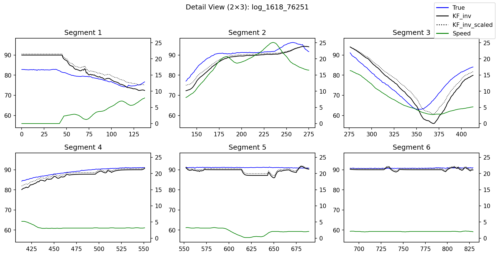
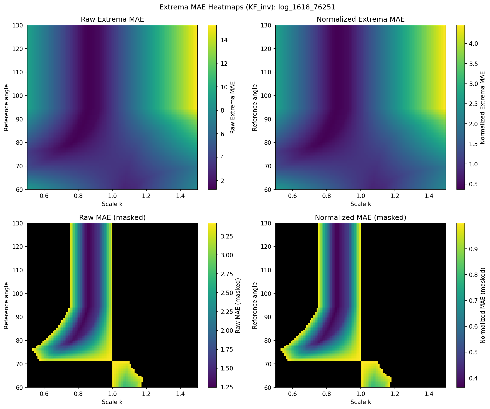
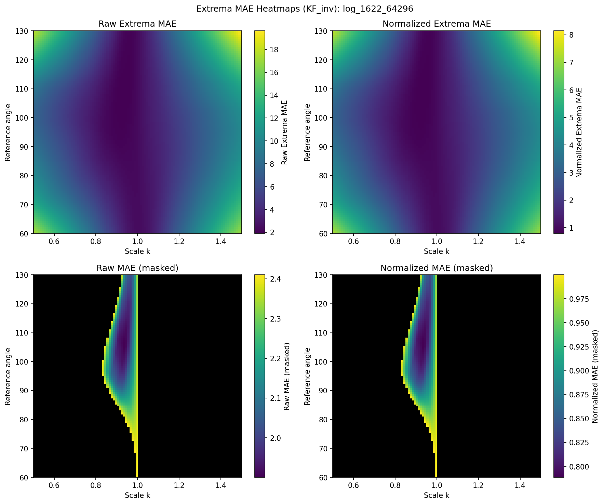
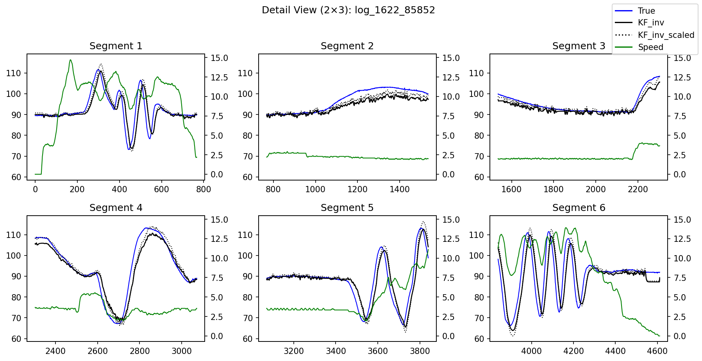
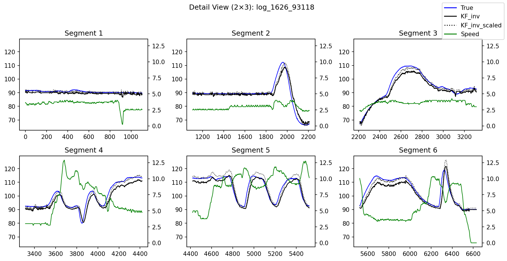

# Angle Sensor Filtering & Extremum Tracking

## Overview
Raw light-sensor arrays provide a noisy glimpse of how the tractor and trailer are oriented. The goal is to turn those inexpensive readings, together with vehicle speed, into a stable hitch-angle signal. A high-quality sensor supplies the ground truth used for calibration and evaluation.
Rather than hard‐coding specific filenames, this workflow is designed to operate on **any new recording** (CSV file) you provide. As long as each CSV follows the same column conventions (left/right sensor sums, a reference angle column, a speed column, and a timestamp), the same preprocessing, filtering, alignment, and evaluation steps will apply.

For up-to-date metrics and plots generated by the CI workflow, see the
[Latest Results](#10-latest-results) section below.

## Main Task

Our goal is to provide a clear example pipeline that:
1. Reads any CSV from `recordings/`.
2. Derives a hitch-angle estimate from the light-sensor arrays.
3. Cleans the reference sensor and vehicle speed columns.
4. Runs a speed-aware Kalman filter and optional alternatives.
5. Aligns the filtered result with the reference and logs error metrics.
6. Saves reproducible plots in `results/` for inspection.

Think of this repository as a starting point for developers to experiment with filtering methods and contribute improvements.


---

## Directory Structure

```
.
├── README.md                  ← This file (generic instructions)
├── filter_analysis.py         ← Python script (load any CSV, process, plot, metrics)
├── recordings/                ← Place one or more CSV recordings here
│   ├── log_1618_76251.csv     ← Example recording file
│   ├── log_1622_64296.csv
│   └── log_1626_93118.csv
└── results/                   ← Auto-generated figures and `performance.csv`
```

- **filter_analysis.py**: Contains all code for loading, preprocessing, filtering, alignment, and performance evaluation. It automatically processes **every CSV recording** in the `recordings/` folder.
- **recordings/**: Directory where you place each new CSV log. Each file must contain the following columns using the exact German names from the logger:
  - `Durchschnitt_L_SE` and `Durchschnitt_L_Be_SE` – left light-sensor sums,
  - `Durchschnitt_R_SE` and `Durchschnitt_R_Be_SE` – right light-sensor sums,
  - `Deichsel_Angle` – drawbar (hitch) angle reference,
  - `Geschwindigkeit` – vehicle speed,
  - `ESP Time` – timestamp in milliseconds.
  - Optional redundant sensors `Durchschnitt_L_SE2`, `Durchschnitt_L_Be_SE2`,
    `Durchschnitt_R_SE2`, and `Durchschnitt_R_Be_SE2` (all zeros when not used).
- **results/**: Created automatically when you run the script. Holds PNG graphs and a `performance.csv` summary table.

---

## 1. What We’re Trying to Accomplish

1. **Compute a raw hitch‐angle proxy** from left/right sensor sums.
2. **Clean the target reference** by interpolating any zero‐dropouts.
3. **Preprocess speed** by clipping negative values, interpolating zeros (only between first and last movement), and applying a small rolling‐average to remove jitter.
4. **Remove spikes** from the raw proxy with a causal Hampel filter (window=5).
5. **Apply a speed‐aware Kalman filter** (KF_inv) in real time, where process‐noise is scaled by 1/speed.
6. **Detect local extrema (peaks & valleys)** in the clean reference signal to quantify how well each filter preserves high/low points.
7. **Align** each filtered output to the reference by matching extremum indices, so that peak/valley errors can be measured at the correct time points.
8. **Compute metrics** (RMSE, MAE, plus specialized extrema‐MAE) to evaluate performance.
9. **Optionally test alternative filters** (e.g. Savitzky–Golay and hybrid KF_on_SG) on the same recording and compare results.

Because each recording file uses identical column names/patterns, you can simply drop new CSVs into the `recordings/` directory and re-run the script.

---

## 2. Preprocessing Steps (Single Recording)

When you run the analysis script on any new recording:

1. **Load the CSV** into a DataFrame.
2. **Identify columns** via their column‐name patterns:
   - `Deichsel_Angle` (drawbar angle reference).
   - `Geschwindigkeit` (speed).
   - `Durchschnitt_L_SE` and `Durchschnitt_L_Be_SE` (left light-sensor sums).
   - `Durchschnitt_R_SE` and `Durchschnitt_R_Be_SE` (right light-sensor sums).
   - Optional redundant sensors `Durchschnitt_L_SE2`, `Durchschnitt_L_Be_SE2`,
     `Durchschnitt_R_SE2`, and `Durchschnitt_R_Be_SE2`.
3. **Compute the raw proxy**:
  - The script automatically checks if the redundant sensor columns contain any
    non-zero values. If they do, the left and right sums include all four
    sensors per side and a constant of ``32`` is added. If the redundant columns
    are all zero the file is assumed to use only two sensors per side and a
    constant of ``16``:
    ```
    # Without redundant sensors
    L = (L_SE + L_Be_SE) + 16
    R = (R_SE + R_Be_SE) + 16

    # With redundant sensors
    L = (L_SE + L_SE2 + L_Be_SE + L_Be_SE2) + 32
    R = (R_SE + R_SE2 + R_Be_SE + R_Be_SE2) + 32
    ```
  - The raw angle proxy is then
    ```
    raw = 90 + (((L + R) / 2) * (L - R)) / (L * R) * 100
    ```
4. **Clean the target**:
   - Replace zeros with NaN, then interpolate linearly (forward and backward).
5. **Preprocess speed**:
   - Clip negative values to zero.
   - Between the first and last nonzero sample, replace zeros with NaN and interpolate.
   - Apply a 5‐sample centered rolling mean, filling any NaNs at the ends with zero.
   - This yields a smooth, causal speed estimate for use in the Kalman filter.
6. **Suppress spikes** in the raw proxy using a **causal Hampel filter** (window=5).

---

## 3. Filtering Methods

Once preprocessing is complete, the script applies one or more of the following filters to `cleaned_raw`:

1. **KF_inv** (Speed‐Aware Kalman Filter)
   - Implements a single-state discrete Kalman filter.
   - `cleaned_raw` is used as the measurement input `x` and the preprocessed
     vehicle speed `speed` serves as the control signal `v`.
   - At each time step the process noise variance `Q` adapts based on the
     inverse of the current speed:
     `Q = 1e-2 + 1e-1 * (1 / max(v[i], 0.1))`.
   - The measurement variance `R` is fixed at `1.0`.
   - Starting from `y[0] = x[0]` and covariance `P[0] = 1`, the filter computes
     the predicted covariance `Pp = P[i-1] + Q` and the Kalman gain
     `K = Pp / (Pp + R)`.
   - The updated state is `y[i] = y[i-1] + K * (x[i] - y[i-1])` with
     `P[i] = (1 - K) * Pp`.
   - Because `Q` is larger when speed is small, the filter responds more quickly
     during slow manoeuvres while remaining smoother at higher speeds.
2. **Savitzky–Golay (SG)**
3. **KF_on_SG** (KF_inv applied to SG output)

All three filters are always computed for comparison. Use the
`plot_filters` list in `filter_analysis.py` to choose which ones appear in the
generated figures.

---

## 4. Extrema Detection & Alignment (Single Recording)

1. **Detect True Extrema**: local maxima/minima of `target_clean` with 10% prominence.
2. **Detect Filtered Extrema**: local maxima/minima of each filtered output with 10% of that series’ range.
3. **Align by Extrema**:
   - For each true extremum index, find nearest filtered extremum index, compute shift = (filtered_idx - true_idx).
   - Take median(shift) = `lag`. Shift the filtered output by `-lag` without wrap-around, repeating the edge values.
   - Now filtered peaks/valleys coincide with true peaks/valleys.

---

## 5. Scaling Optimization

After alignment, each filtered output is rescaled by searching a dense grid of
reference angles and scale factors. Reference candidates are drawn from the
range of the aligned signal itself, with 200 points concentrated around the
signal mean and clamped to its min/max. For every reference, scale factors from
0.8 to 1.2 (100 steps) are tested. The pair that yields the lowest MAE is selected.
The resulting `ref_angle` and `scale_k` are logged for each filter.

---

## 6. Performance Metrics (Single Recording)

After alignment:
- **RMSE**: sqrt(mean squared error over all valid samples).
- **MAE**: mean absolute error over all valid samples.
- **MAPE_pk**: mean absolute error at true-peak indices.
- **MAVE_vl**: mean absolute error at true-valley indices.
- **Extrema_MAE**: mean absolute error over all true-peak+valley indices.
- **RMSE_scaled**: RMSE after scaling optimization.
- **MAE_scaled**: MAE after scaling optimization.
- **Extrema_MAE_scaled**: mean absolute error at true extrema after scaling.

---

## 7. How to Use

1. **Place recording(s)** (CSV files) in `recordings/`.
2. **Edit `filter_analysis.py`** if needed:
   - Adjust `exclude_first_seconds` (default = `None`).
   - Update the `trim_seconds` dictionary for per-file start/end trimming.
3. **Run**:
   ```
   python filter_analysis.py
   ```
   - The console prints performance metrics.
   - Three figures appear:
     1. **General + Alignment** (two‐subplot).
     2. **Detail View** (2×3).
    3. **Normalized Extrema MAE Heatmap** showing scale vs. reference (axes are identical for all files).

4. **Add new recordings**:
   - Just drop additional CSVs into `recordings/` and run the script again.
5. **Generated figures** are saved in `results/` as PNG files when you run the
   script. These images are reproducible and don't need to be committed to
   version control.

---

## 8. Automated Runs

A GitHub Actions workflow (`run-analysis.yml`) installs Python **3.12**, installs the requirements, and then runs `python filter_analysis.py` whenever you push changes. The generated plots in `results/` are uploaded as workflow artifacts so you can inspect them without committing the PNG files.

---

## 9. Results Directory

Running the script creates a `results/` folder containing:

- `performance.csv` – table of metrics for every recording and method.
- `General_<recording>.png` – overview plot with alignment.
- `Detail_<recording>.png` – zoomed detail view.
- `Heatmap_<recording>.png` – heatmap of normalized Extrema MAE over scale and reference.

`performance.csv` columns:

| Column | Meaning |
|-------|---------|
| `Filename` | source CSV log |
| `Method` | filtering method used |
| `RMSE`, `MAE` | overall error metrics |
| `Extrema_MAE` | error at detected peaks/valleys |
| `Extrema_MAE_scaled` | peak/valley error after scaling |
| `MAPE_pk` | mean absolute peak error |
| `MAVE_vl` | mean absolute valley error |
| `Lag` | alignment shift in samples |
| `Ref_Angle` | optimal reference angle |
| `Scale_k` | scale factor applied |
| `RMSE_scaled`, `MAE_scaled` | errors after scaling |

---

## 10. Latest Results

The table and figures below are updated by the GitHub Actions workflow on every push that runs `filter_analysis.py`. The workflow regenerates `results/performance.csv` and all plots in `results/`, ensuring this section always reflects the latest CI analysis. Each recording also includes a heatmap showing how the `Extrema_MAE` ratio changes with reference angle and scale.

<!-- RESULTS_TABLE_START -->
<details><summary>Performance Summary</summary>

| Filename       | Method   |    RMSE |     MAE |   Extrema_MAE |   Extrema_MAE_scaled |   MAPE_pk |   MAVE_vl |   Lag |   Ref_Angle |   Scale_k |   RMSE_scaled |   MAE_scaled |
|:---------------|:---------|--------:|--------:|--------------:|---------------------:|----------:|----------:|------:|------------:|----------:|--------------:|-------------:|
| log_1618_76251 | KF_inv   | 2.47858 | 1.73186 |       3.42423 |              1.29539 |   2.27022 |   3.71274 |    19 |     94.418  |  0.867347 |       2.18408 |     1.37048  |
| log_1618_76251 | SG       | 2.59131 | 1.90651 |       2.00123 |              1.55931 |   2.94572 |   1.7651  |     4 |     93.3878 |  0.887755 |       2.30495 |     1.48846  |
| log_1618_76251 | KF_on_SG | 2.40439 | 1.80014 |       1.85107 |              1.76861 |   3.20227 |   1.51327 |    11 |     93.1637 |  0.887755 |       2.15115 |     1.39678  |
| log_1622_85852 | KF_inv   | 2.46887 | 1.87185 |       1.96114 |              1.21081 |   2.38705 |   1.42877 |     9 |     84.1413 |  1.13265  |       1.96038 |     1.45094  |
| log_1622_85852 | SG       | 2.53055 | 1.88825 |       3.48735 |              2.41057 |   3.60956 |   3.33459 |     5 |     86.5115 |  1.17347  |       1.89668 |     1.29419  |
| log_1622_85852 | KF_on_SG | 2.80495 | 2.06362 |       4.05899 |              2.83376 |   4.27546 |   3.78839 |     9 |     86.4873 |  1.17347  |       2.18772 |     1.47361  |
| log_1626_93118 | KF_inv   | 2.22865 | 1.83955 |       2.13766 |              1.36887 |   2.91195 |   1.42293 |    13 |     80.5784 |  1.11224  |       1.26738 |     0.881841 |
| log_1626_93118 | SG       | 2.51369 | 1.96083 |       2.21602 |              1.30091 |   2.94388 |   1.54414 |     0 |     80.5596 |  1.11224  |       1.74674 |     1.13649  |
| log_1626_93118 | KF_on_SG | 2.606   | 2.00142 |       2.29233 |              1.25904 |   3.12408 |   1.52455 |     4 |     81.6966 |  1.11224  |       1.88278 |     1.21904  |
| log_1622_64296 | KF_inv   | 3.13407 | 2.51597 |       2.41009 |              1.93043 |   2.38969 |   2.43168 |    10 |    105.691  |  0.908163 |       2.82166 |     1.99882  |
| log_1622_64296 | SG       | 3.13703 | 2.46259 |       3.91841 |              3.66967 |   4.03643 |   3.79346 |    10 |    117.957  |  0.94898  |       2.8645  |     1.98493  |
| log_1622_64296 | KF_on_SG | 3.09645 | 2.47268 |       4.08145 |              3.98822 |   4.63121 |   3.49934 |    12 |    129.396  |  0.969388 |       2.85577 |     2.01344  |
| log_1626_30685 | KF_inv   | 2.09207 | 1.47532 |       2.00824 |              1.87087 |   2.37958 |   1.53374 |    12 |     86.7927 |  1.13265  |       1.69887 |     1.13277  |
| log_1626_30685 | SG       | 2.85092 | 1.95532 |       4.24686 |              4.12027 |   3.95365 |   4.62151 |    11 |     87.9362 |  1.17347  |       2.57031 |     1.5671   |
| log_1626_30685 | KF_on_SG | 2.75474 | 1.85532 |       4.40672 |              4.24798 |   4.21663 |   4.64961 |    14 |     87.9471 |  1.17347  |       2.34827 |     1.41894  |
</details>
<!-- RESULTS_TABLE_END -->

<!-- RESULTS_PLOTS_START -->
<details><summary>log_1618_76251</summary>





</details>
<details><summary>log_1622_64296</summary>




</details>
<details><summary>log_1622_85852</summary>





</details>
<details><summary>log_1626_30685</summary>


</details>
<details><summary>log_1626_93118</summary>





</details>
<!-- RESULTS_PLOTS_END -->

## 11. Current Challenges

Early versions of the filters produced a large extrema MAE, meaning peaks and
valleys were often poorly matched even when overall error looked reasonable.
To address this we performed a grid search for a simple linear scaling of each
aligned filter. The "scaled" columns in the table show the best result of that
search and often reduce the extrema MAE considerably.

**Issues observed**

a) The linear scale does not consistently help across all segments. For
`log_1622_85852`, for instance, the scaled output around the 3800th second
(segment 5) actually worsens the error, implying the underlying relationship
between the proxy and the true angle can change over time.

b) The optimization currently uses the entire recording, which makes it
noncausal. While many logs yield similar parameters (around 80° reference and
scale about 1.1), others diverge substantially—some below 0.9 in scale and well
above 90° in reference. This variation suggests the data may be non-stationary
and that a single global scaling does not fit every file.

In practice we need a causal method to estimate both reference angle and scale
dynamically, adjusting to changing conditions without relying on future data.
Finding a stable real-time solution is still an open challenge.
